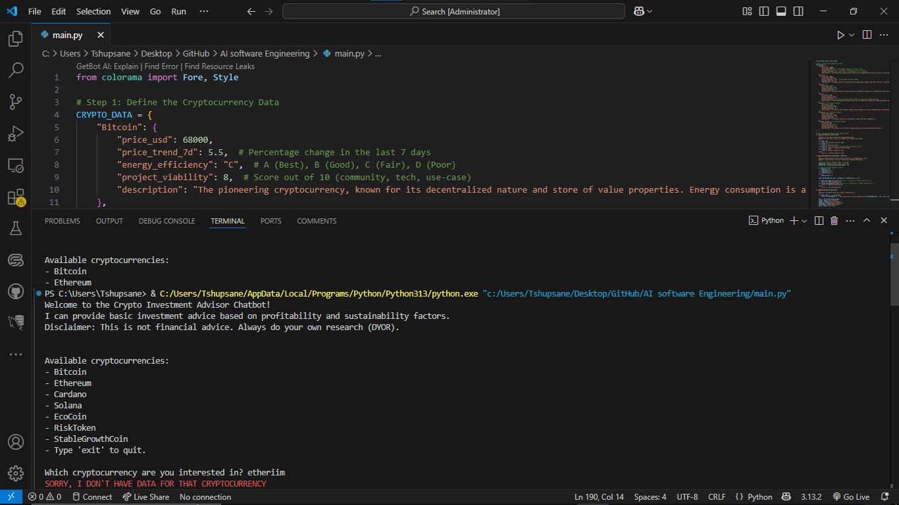

# AI-SE-week1-CryptoCurrencyBot
The ChatBot Mimics basic AI decision-making

# Cryptocurrency Investment Advisor Chatbot

A simple command-line chatbot that provides basic investment advice on various cryptocurrencies based on profitability and sustainability factors.

### Features

- Fetches real-time data for selected cryptocurrencies.
- Analyzes profitability and sustainability to generate investment advice.
- Provides a simple, interactive command-line interface.
- Disclaimers to remind users to perform their own research.

### How It Works

The chatbot uses a predefined dictionary of cryptocurrencies with their associated data. It analyzes this data to provide investment advice. The bot also includes a disclaimer to ensure users understand that the advice is not a substitute for professional financial guidance.

### Installation

To run the chatbot, follow these steps:

1. Ensure Python is installed on your system.
2. Clone this repository or download the `CryptoCurencyBot.py` script.
3. Install the required Python package by running:

install colorama library if you haven't for Colors on texts.

 `pip install colorama`

4. Run the script using CrytptoCurrencyBot.py

#### Usage

1. Start the chatbot by running the script.
2. Type the name of a cryptocurrency when prompted.
3. The chatbot will provide investment advice based on the cryptocurrency's data.
4. Type `exit` to quit the chatbot.

### Screenshots

Below are three screenshots demonstrating the chatbot's performance:

These screenshots showcase the chatbot's ability to analyze cryptocurrency data and provide investment advice.

### Disclaimer

- The chatbot provides investment advice based on a simplified model.
- It is not a substitute for professional financial advice.
- Always perform thorough research and consult with a financial advisor before making investment decisions.

### Contributing

Pull requests are welcome. For major changes, please open an issue first to discuss what you would like to change.

Please make sure to update tests as appropriate.

### Contact

Your Name - [Klaas Matlou] [tshupianematlou@gmail.com]

Project Link: [GitHub](https://github.com/KlaasMatlou/crypto-investment-advisor-chatbot)
